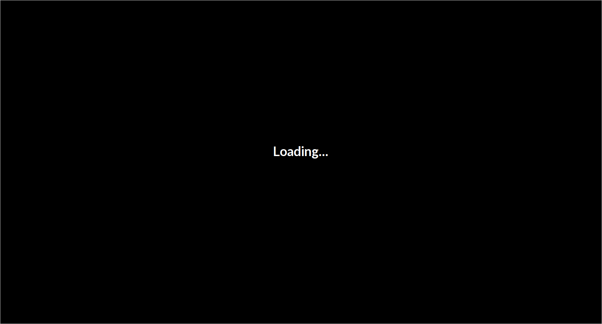
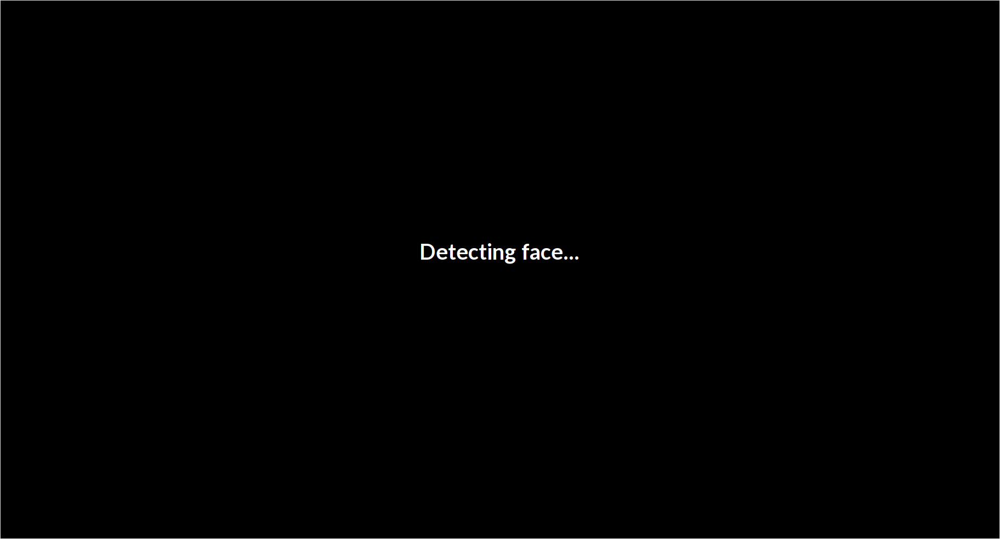
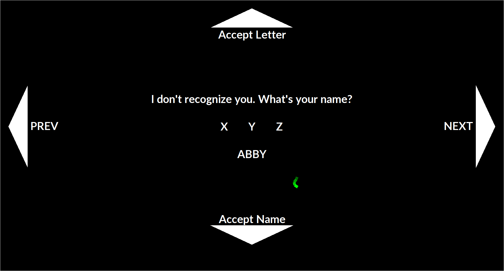
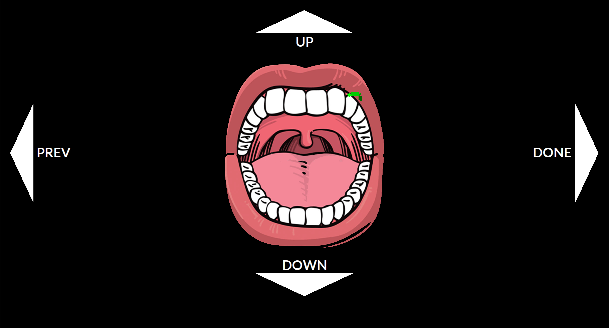
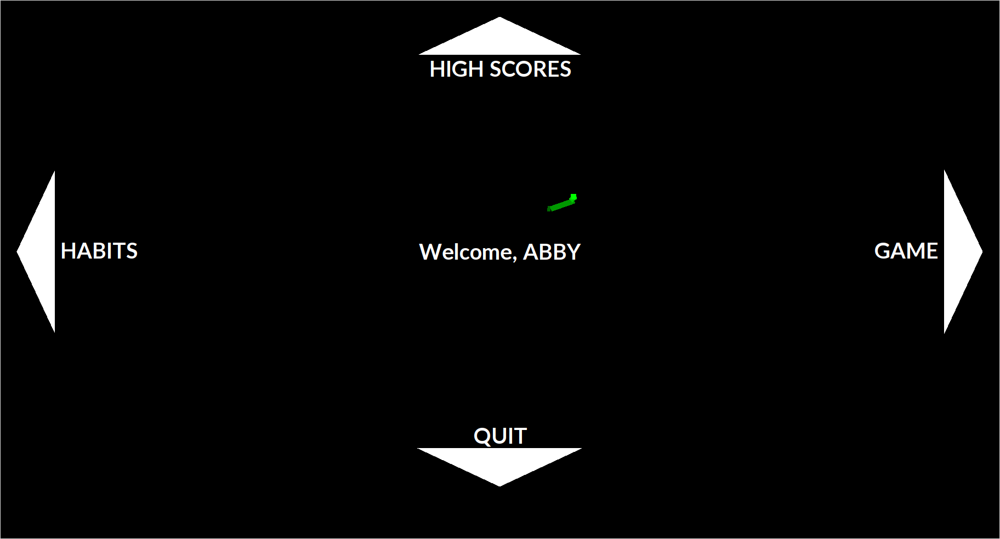
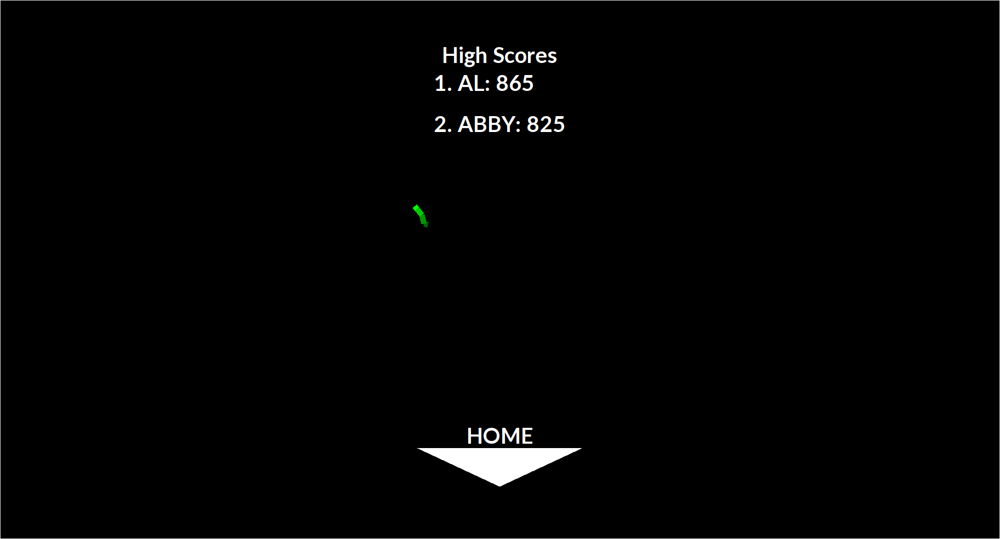
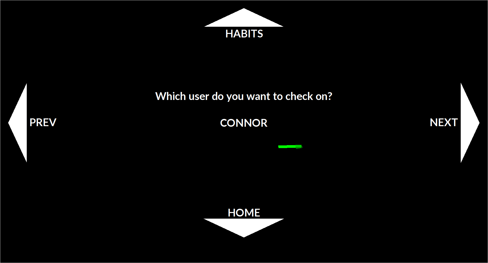
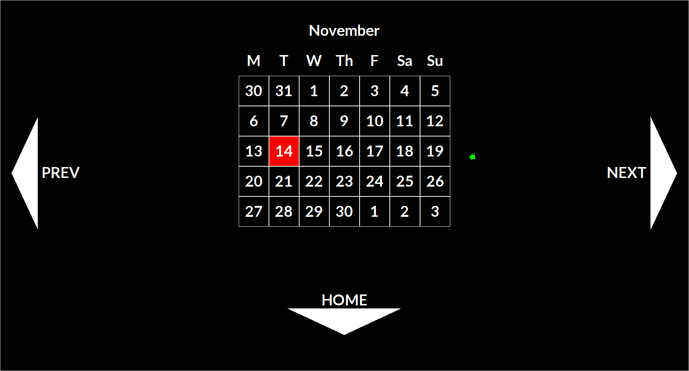
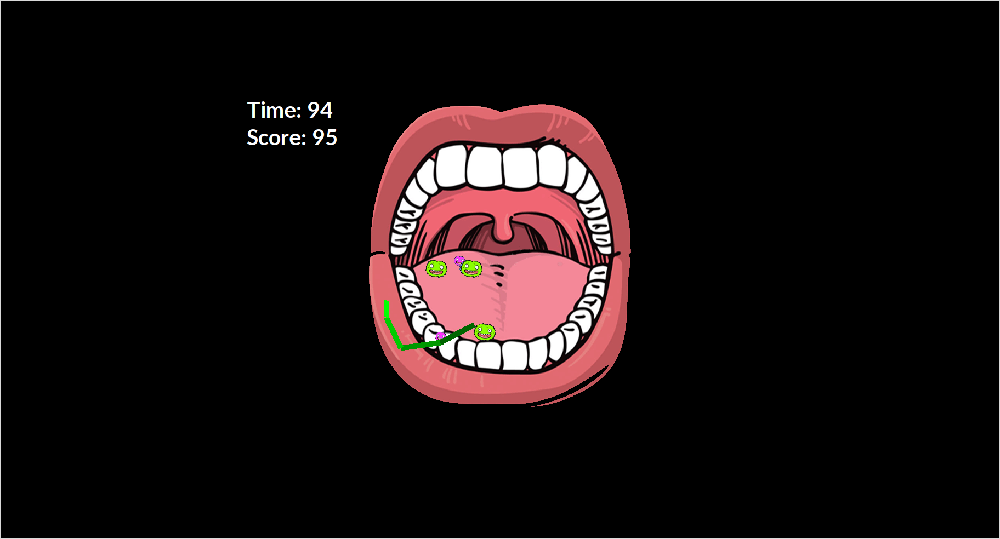

# BrushSmart - User Manual

## Description
Individuals of all ages often dislike brushing their teeth and studies have shown that most individuals do not brush for the ADA (American Dental Association) recommended 2 minute duration. Which is not surprising since the world is incredibly face-paced and technology is continually increasing. Our idea is to utilize the advancements in technology with the timeless concept of brushing teeth and to introduce the BrushSmart Mirror, a mirror that we have transformed into an interactive game.

## Technical Requirements
The BrushSmart Mirror requires access to a 120 Volt AC (alternating current) outlet to supply power to the mirror. Also, it is necessary to have adequate space (at least 2 feet) between the mirror and person using the mirror. A typical bathroom sink should be sufficient space.

## Usage
The BrushSmart Mirror is intended for use by individuals who seek to add entertainment to their daily tooth brushing. For child who are just learning to brush their teeth, to elderly individuals who would like to keep track of their brushing habits, the BrushSmart Mirror can act as a tooth brushing aid for people of all ages.

## Installation
The BrushSmart Mirror must be placed directly in front of the user, so that the user’s mouth is approximately in the middle of the mirror.
Plug in the power cable into a 120V AC outlet.
Two pieces of the mirror must be turned on and may be left on (the mirror has power saving capabilities):
Mirror screen
Raspberry Pi
Once turned on, the BrushSmart Mirror system should be started and the user can follow the instructions for creating a new user. 
See Menu Options Description > New User

## Program Screens 

### Loading Screen

Please wait for the program to load all the resource on boot up.

### Detecting Face

The detecting face screen indicates that the program is looking for a face so please look will look directly at the camera. 

### New User Registration
Prior to seeing the Main Menu, when you start the SmartBrush Mirror for the first time you will see a screen like this:

Swiping left or right will move the letters. The letter in the middle of the screen represents the selected letter. In order to select this letter, swipe in an upward motion. Repeat this until your name is correct, then swipe down.

### Calibrate 

Use the up and down arrows to calibrate the mouth to your own mouth for a better gaming experience.

### Home 
Once a user is registered or logged in via facial recognition, this main menu will be displayed:

### High Scores

The high score displays the the single highest score from each user in the system. 

### Select User Habits

You can view others habits by using the right and left arrows to pick which user's habits you want to see.

### Habits

Brushing Habits will display a graphical calendar for the current month and you may view other months by swiping left or right. Here is an example. The blue days indicate that only one brushing occurred, green days indicate two brushings and red indicates no brushing recorded.

### Game
You may start a game by swiping right in the Main Menu. Follow the instructions on the screen to initiate a game.

After the game is finished, you will see your final score and can return to the Main Menu.

#### Game Objective
The objective of the game is simple, eliminate as many germs as you can!

#### Game Rules
- You will be given 2 minutes to eliminate germs by having the green line (where your toothbrush is) cross over them.
- There are three different types of germs
 	- Green: 10 points
 	- Blue: 15 points
 	- Pink: 20 points
- A germ will spawn in 1 of 4 random sections. These are the same sections (quadrants) of your mouth that you should be brushing:
	- Top left
	- Top right
	- Bottom left
	- Bottom right
- Each section will be displayed for 30 seconds (a timer is shown on the top right of the mirror) and after each 30 seconds another section will be displayed with germs to be eliminated.
- As germs are eliminated, the score (displayed on the top right of the mirror under the timer) will increase. Kill smaller germs to get a higher score!
- After all 4 sections have been displayed (i.e. 2 minutes are up), the game will be over and the score screen will be shown:

## Frequently Asked Questions
**Q: How does the mirror recognize who I am?**

*A: The BrushSmart Mirror uses the mirror for facial recognition with its built-in camera in order to recognize users.*

**Q: What is the highest score possible in the game?**

*A: There isn’t one! A player would have to have super-human abilities to reach the absolute maximum score in a game.*

**Q: How many users are allowed to use the mirror?**

*A: You can have as many users as you’d like!*

**Q: Can I manually change my brushing habits?**

*A: In order to prevent “cheating”, we do not allow users to modify their scores or brushing habits.*

**Q: Can I share my scores and brushing habits on social media?**

*A: Currently, we do not have this functionality, but it’s our goal to have this as an option for a future release!*