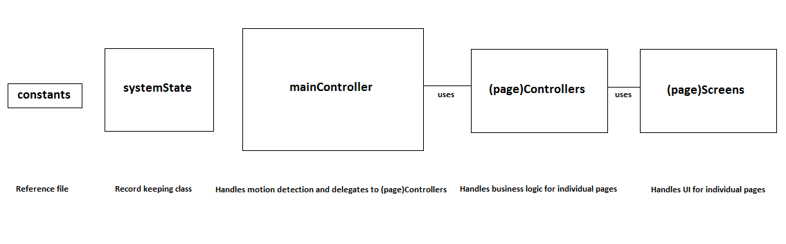
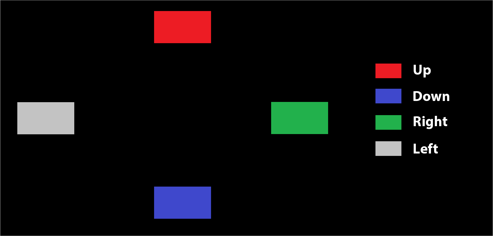

# BrushSmart - Developer Guidelines

## Introduction 
Welcome to our project, the BrushSmart Mirror. The goal of this project is to try and get kids interested in brushing their teeth. To facilitate this, we’re designing an electronic mirror used in place of the typical bathroom mirror, with a game that can be played while brushing their teeth. We’ve also designed other functionality for parents. Since every user has an account on the system, parents can check out their own or their child’s brushing habits to make sure they’re keeping up. Because all of this is intended to be used in a bathroom where most input devices are infeasible, the entire program is motion-controlled, using a colored ring (for now) for the system to detect.

## Installation
To install it on your system, download all the source files from our GitHub repository. You will also need to install Python 3.0 or later, OpenCV library v3.2.0, TkInter package, and the face_recognition library. Once you’ve done that, you can run it by calling the Python interpreter (‘python’) on mainController.py.

## Structure
Here’s a simplified outline of our project structure, with the most important aspects for you as a developer:

Let’s start with the mainController. As the name implies, this is the entry point. It starts by creating a SystemState object called state, which keeps track of all necessary values the system may need during execution. Then, it creates two threads, with the first thread’s purpose to always monitor the user via the camera and track their corresponding motions. This thread uses the motionTracking method, so if you wish to refine our way of color tracking, go there. This method also calls the setDirection method, which is how our program decides which of the 4 directions (represented as an enumeration) the user has swiped in.

The other thread is for handling all of the underlying business logic of our program, and uses the method changeData. We use an enumeration called Page to keep track of what page the program is currently on, and based on that, the mainController calls one of several possible subcontrollers to do the necessary work. Every type of page has an associated controller with it. All of these controllers are denoted as (page)Controller.py (homeController as an example), and they all have a method called Control that the mainController calls. This methods handles all the business logic for that particular page, and needs to take in the state object as a parameter.

Besides handling any business logic for that page, every controller also calls a corresponding (page)Screen’s Draw method, and again passes the state to it. The purpose of these (page)Screen.py files is for UI. Our system is designed so that this is divorced from the business logic, so those interested in designing UI can do so without detailed knowledge of the rest of the system. Any necessary data for display can be found in the state object passed to the Screen.

Next, there is the constants.py file. Naturally, this file is filled with constants used by the rest of the program. Most importantly, it houses all enumerations, so if you wish to use the Direction or Page enums, you will need to import this file and preface any of these enum values with constants.value.

## How and Where You can Contribute
To summarize where you should go depending on what your contributing interest is:

- Refining our tracking mechanism: motionTracking method in mainController.py
- Refining our direction detection: setDirection method in mainController.py
- Adding a new page to the system: add it to the Page enumeration in constants.py, extend the ifelse block in changeData in mainController.py to call the (newPage)Controller.py’s Control method you create when the currentPage is your new page, put any business logic in (newPage)Controller.py, as well as a call to the (newPage)Screen.py’s Draw method you create, which houses the UI. You may also need to add fields to systemState.py.
- Adding behavior to or modifying the behavior of an existing page: Control method in the corresponding (page)Controller.py file, and possibly adding fields to systemState.py.
- Modifying the UI: Draw method in the corresponding (page)Screen.py file.

## Frequently Asked Questions
**So how does all this tracking stuff work?**

We make heavy use of a library called OpenCV. It takes capture from a camera, then converts it to an alternate coloring scheme called HSV (Hue-Saturation-Value) which is better suited for tracking than RGB. After that, we look for a range of specially pre-defined (found through experimentation) HSV values in the captured frame, corresponding to the ring the user wears. This is called thresholding, which converts the captured frame to a black and white image, with the white pixels being those in the specified HSV range. We then essentially calculate the center of mass of those white pixels to determine what point on the screen most accurately corresponds to where the ring is.

To navigate through the menu screens, there are four different areas where the motion of the ring is tracked. If the ring is captured in one of these areas it will act accordingly. See the following graphic for a breakdown, depending on where the newest point is located:

**I still don’t really get it…is this a problem?**

Not at all. You can still contribute to our business logic or UI without understanding how it works.

**Do I need a specially-designed mirror set-up to contribute?**

Not necessarily, it can be ran on a computer as long as you have some sort of capture device. However, if you want to design UI, keep in mind that your design aesthetic may not work as well as intended when the background is a reflection.

**I’ve never used Python and/or OpenCV. Where can I learn about them?**

[Python](https://docs.python.org/3/tutorial/index.html), [OpenCV](http://docs.opencv.org/3.2.0/d6/d00/tutorial_py_root.html), and [TkInter](https://wiki.python.org/moin/TkInter) have very good tutorials on their respective websites. [effbot.org](http://effbot.org/tkinterbook/) also has many helpful examples. Check them out!

Got any questions we didn’t answer? Feel free to shoot one of us an e-mail with [BrushSmart] in the title, and we’ll make sure to get back to you.

Connor: connorbl93@yahoo.com

Kyle: kylelikewhoa@gmail.com

Hao: haolu2013@gmail.com

